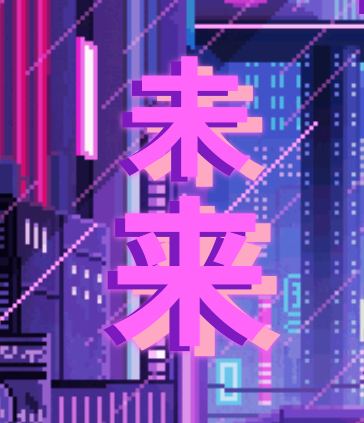

# MIRAI WEB LAB

Inspired by the word "未来," meaning "future" in Japanese, our mission is to craft cutting-edge digital experiences that push the boundaries of creativity and technology.

We specialize in web development, digital design, and creative solutions with futuristic, innovative concepts. Our approach is all about creating immersive, visually striking websites that feel like stepping into a neon-lit world of endless possibilities.

We’re more than just a web lab, we’re digital architects of the future. Whether you need a bold online presence, a customized user experience, or a tech-forward solution that stands out, Mirai Web Lab is here to bring your vision to life.

## ✨ Our Philosophy

In a world driven by rapid innovation, staying ahead means staying bold. We fuse technology, creativity, and culture to build futuristic, pixel-perfect solutions that leave a lasting impact. Our studio thrives on exploring the edges of digital design, creating experiences that are as visually captivating as they are functional.

## 💻 What We Do

- **Web Development:** From sleek landing pages to fully interactive platforms.
- **UI/UX Design:** Focused on user engagement with cyberpunk-inspired aesthetics.
- **Creative Branding:** Bringing your brand to life with neon-glitch visuals and pixel art.
- **Digital Experiences:** Building worlds beyond the screen that feel like a glimpse into the future.

## 🌐 Why Choose Us?
At Mirai Web Lab, we understand that your brand is your identity. We craft unique, futuristic designs that not only represent your business but also capture your audience's attention. Our work is bold, vibrant, and memorable, ensuring your project stands out in a crowded digital world.

Join us, and let's shape the digital future together.

## Pages and Sections

1. **Home**: Introduction and general overview of the business.
2. **About Us**: Information about Mirai, and his values.
3. **Templates**: A dynamic gallery where users can explore the different templates available for customization.
4. **Contact**: Contact information for the business.
5. **Template Details**: An individual page for each template, showing details, examples and customization options.

## Authors

- [@JjuliSanz](https://github.com/JjuliSanz)

   <h1 style="font-size: 48px; font-weight: bold; font-family: sans; color: var(--quinto);">
    未来
  </h1>
  

